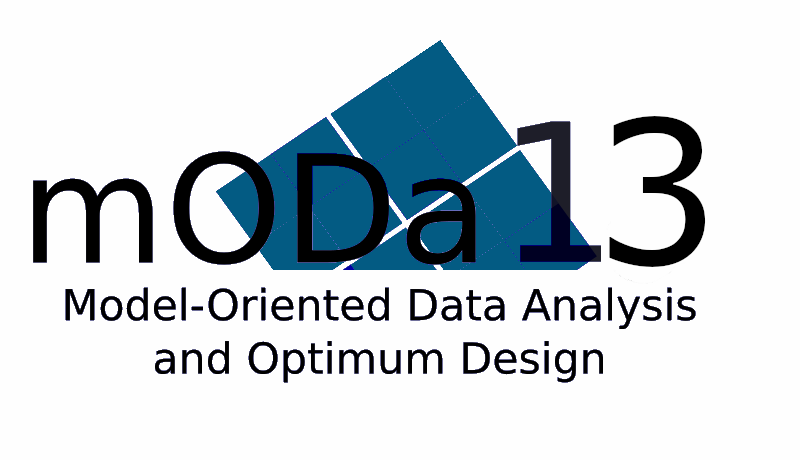

```{r setup, include=FALSE}
knitr::opts_chunk$set(echo = FALSE)

# Learn more about creating websites with Distill at:
# https://rstudio.github.io/distill/website.html

# Learn more about publishing to GitHub Pages at:
# https://rstudio.github.io/distill/publish_website.html#github-pages

```

```{r mODa-logo, out.width = "50%", fig.align = "center"}

```


The scientific workshops on model-oriented data analysis and optimum design (mODa) provide a high-level international forum for researchers, professionals and practitioners to present and discuss recent advances, new techniques and applications in the field of optimum experimental design. In addition, a primary aim is to provide young researchers an opportunity to establish personal contacts with leading specialists in the field. Its specificity is that the participation is by invitation of the board only. 

<!-- For details, see mODa charter (pdf). -->

mODa is (generally) organized every three years, with the previous mODa12 held in Smolenice, Slovakia. After a short Covid-induced delay, the 13th edition of the workshop series will be held in Southampton, UK, 9-14 July 2023.

**Supported by:**

```{r, echo = FALSE, out.width = "40%",fig.show = 'hold', fig.align = 'center', fig.cap = ""}
knitr::include_graphics(c("images/ICMS.png", "images/soton_logo.jpeg", "images/jmp.png", "images/janssen.png", "images/cup.png"))
``` 