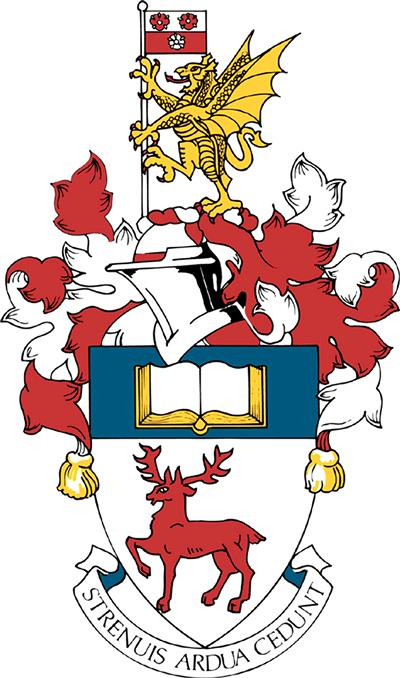

```{r setup, include=FALSE}
knitr::opts_chunk$set(echo = FALSE)
```

The 13th mODa workshop will be hosted by the [Southampton Statistical Sciences Research Institute (S3RI)](http://www.soton.ac.uk/s3ri) at the [University of Southampton](http://www.soton.ac.uk) [Avenue Campus](https://www.southampton.ac.uk/student-life/campuses/avenue).

```{r soton-crest, out.width = "50%", fig.align = "center"}

```

There has been an intitution of higher education (the Hartley Institute) in Southampton [since 1862](https://www.southampton.ac.uk/about/reputation/history-timeline.page), with a University College at the main Highfield Campus since 1919. The University gained it's Royal Charter in 1952. S3RI was formed in 2003 to synergise the research of statisticians across the Mathematical, Social and Health Science, and Medicine. It will be celebrating its 20th anniversary when mODa13 is held.  

<iframe src="https://www.google.com/maps/embed?pb=!1m18!1m12!1m3!1d1495.2445619100063!2d-1.4020710093918929!3d50.9294258367944!2m3!1f0!2f0!3f0!3m2!1i1024!2i768!4f13.1!3m3!1m2!1s0x487474064491597b%3A0x7a832ae220279363!2sAvenue%20Campus!5e0!3m2!1sen!2suk!4v1660332969366!5m2!1sen!2suk" width="600" height="450" style="border:0;" allowfullscreen="" loading="lazy" referrerpolicy="no-referrer-when-downgrade"></iframe>
