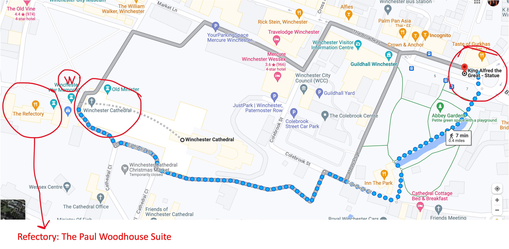

```{r setup, include=FALSE}
knitr::opts_chunk$set(echo = FALSE)
```

The Wednesday excursion is a trip to Winchester, including tours of the cathedral and city.

You should have signed up to groups A-D for the cathedral tour and 1-3 for the city tour.

## Arrival

Coaches will depart Chamberlain Halls at 13.30, and drop us off at King Alfred Statue in Winchester. Groups A and B will proceed directly to the cathedral, groups C and D will take a longer river walk.

```{r, out.width = "100%", fig.align = "center"}

```

## Departure

The walking tours conclude at the Westgate. Coaches will depart from the Sussex Street bus stop at 18.00 and 18.15.

```{r, out.width = "100%", fig.align = "center"}
knitr::include_graphics("images/winchester_departure.png")
```

## Refreshments

Cathedral Refectory between 14.15 and 16.45.

## Timetable

 - 13:30 Bus pickup from Chamberlain
 - 14:00 Arrival to Winchester
 - 14:15+ Cathedral Tour in smaller groups (remember your group!)
 - 16:15+ City Tour in smaller groups (remember your group!)
 - 18:00 Bus pick-up (Sussex Street Bus Stop)
 - 18:15 Bus pick-up (Sussex Street Bus Stop)

90 minutes CATHEDRAL TOURS starting at:

 - 14:15 pm (Group A)
 - 14:30 pm (Group B)
 - 14:45 pm (Group C)
 - 15:00 pm (Group D)
 
90 minutes walking CITY TOURS starting at:

 - 16:15 pm (Group 1)
 - 16:30 pm (Group 2)
 - 16:45 pm (Group 3)

 

